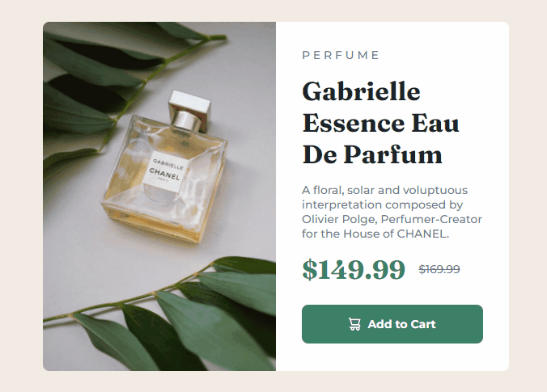

<h1 align="center"> Perfume Page </h1>

  <a href="#-tecnologias">Tecnologias</a>&nbsp;&nbsp;&nbsp;|&nbsp;&nbsp;&nbsp;
  <a href="#-projeto">Projeto</a>&nbsp;&nbsp;&nbsp;|&nbsp;&nbsp;&nbsp;
  <a href="#-collaborators">Collaborator</a>&nbsp;&nbsp;&nbsp;|&nbsp;&nbsp;&nbsp;

 

  

## 🚀 Tecnologias

Esse projeto foi desenvolvido com as seguintes tecnologias:

- HTML
- CSS
- Git e Github

## 💻 Projeto

Criação de uma página responsiva de um produto (perfume).

_<h2 align="center" ><a href="https://rickazuo.github.io/challenge-perfume/" target="_blank">Visite o projeto online</a></h2>_

## 📃 Collaborator

This challange was made by [Ricardo](https://rickazuo.github.io/portfolio/)
